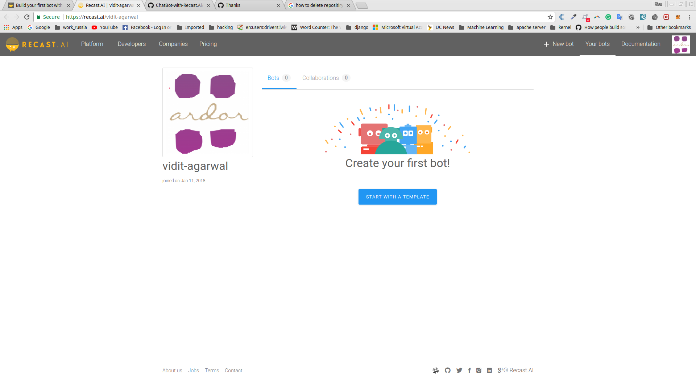
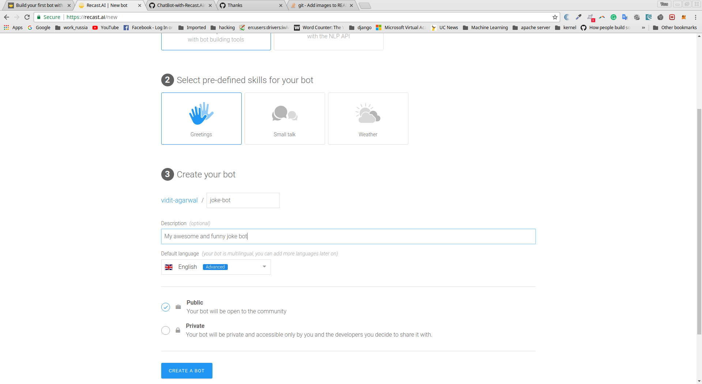

# ChatBot-with-Recast.Ai
Build your first bot with Recast.AI

```
When you’re a beginner bot builder, learning about natural language understanding, conversation flows and messaging platforms can feel a bit overwhelming.

In this guide, I’m going to help you build your first bot on Recast.AI.

You will have a functional chatbot, and you will know how to:

  Make your bot understand human language
  Build a conversation flow
  Deploy your bot to Facebook Messenger
  With Recast.AI, you can easily design complex conversational flows fueled by a powerful artificial intelligence .
  
```
## REQUIREMENTS

<br /> To begin, `create an account on Recast.AI! It’s free.`
<br /> Once you’re logged in, it’s time to create your first bot. Click on the button `“Start with a template”, or just on + NEW BOT` in the header section.

<br />Choose `“Create a complete chatbot”.`
<br />You can choose one or many pre-defined skills for you bot. This will help you get started faster. Just select `“Greetings”` for now, but I encourage you to check the others later.
<br />Choose your name. `“joke-bot”` would be appropriate
<br />Add a description. `“My awesome and funny joke bot”` or something less cocky
<br />Set `English` as the default language.
<br />You can keep your bot `public` as there is no private info, but you can change this setting later.
<br /> 

```
There are 5 phases in your bot life, represented on our platform through the use of 5 tabs:

  Train – Teach your bot what it needs to understand
  Build – Create your conversational flow with our Bot Builder tool
  Code – Connect your bot with external APIs or a database
  Connect – Ship your bot to one or several messaging platforms
  Monitor – Train your bot to make it sharper, and get insights on its usage!

For this repo I’ll skip the “Code” part, because we won’t need any external information
```
## TRAIN YOUR BOT TO UNDERSTAND HUMAN LANGUAGE
```
This is the brain of your bot, where all its understanding is gathered, divided into intents.

An intent is a “box” of sentences that all carry the same meaning, even though they can be very different to one another. When a user sends some text to your bot, our algorithm compares it to the phrases in your intents. Then it checks if it’s close enough to one of them and decides what the intention of the message is.

For example:

    Are you a bot?
    You reply so fast, I’m sure you must be some kind of robot.
    Am I speaking to a human or not?

are all different, but they all ask the same question that we can can sum up as: Are you a bot? Well, that would make a great intent! If your bot is able to recognize this question, you can prepare a smart reaction, like “I’m a robot and I’m proud of it “.
```
## FORK INTENTS

```
All bots should understand basic things such as ‘greetings’, ‘agree’, ‘disagree’, or when a user asks for help.

If you chose the pre-defined Skill “Greetings” when you setup your bot, you will already have two intents: goodbye and greetings.

As Recast.AI is collaborative, you do not have to recreate each intent every time! You can ‘fork’ an intent someone already created to clone it right into your bot. Since we need to understand that our user wants to be told a joke, let’s find if the community has already created this intent for us.
```
## CREATE A NEW INTENT

```
If you want a custom intent, you can build it from scratch. Here, we want the bot to understand when someone laughs at the joke.

Click on + CREATE on the right of the search field, and choose a name for your intent:

Repeat this process for intent that gathers negative reactions to your jokes:

```
## ADD EXPRESSIONS

```
Now that we have intents, we need to populate them with various expressions. An expression is the name of a sentence added to an intent.

A golden rule would be to add 20 expressions to an intent for a development bot, and 50 or more for a production bot.

Click on an intent and add sentences you want your bot to understand. Put yourself in the shoes of the people talking to your bot.What could they possibly ask? Enter a new expression by typing it into the field Add an expression. Here are some examples:

Laughs:

    hahah that’s hilarious
    ROFL you’re good!
    That, my friend, was an amazing joke.
    I haven’t laughed that much in a long time!
    
Lame:

    You have no sense of humour whatsoever.
    That’s both terrible and offensive.
    What the heck was that?
    Try harder, that was a very bad joke.

```

### For complete and detailed reference : https://recast.ai/blog/build-your-first-bot-with-recast-ai/
